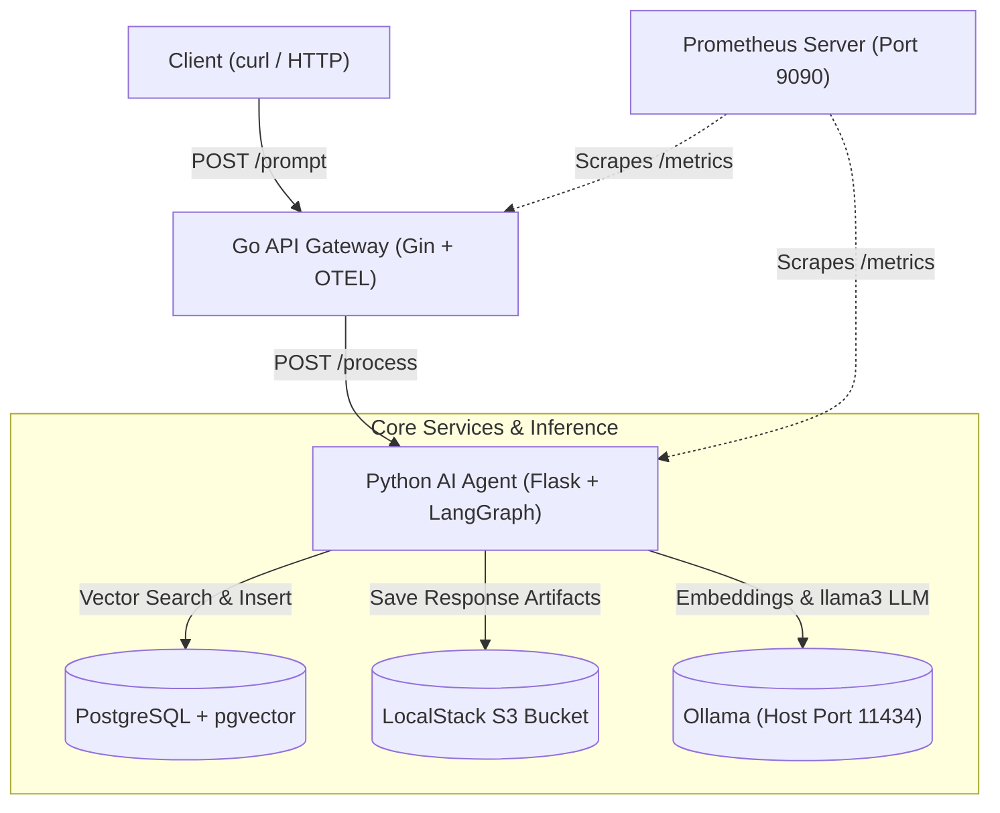

# Cloud-Native AI Sandbox

[](https://go.dev/)
[](https://www.python.org/)
[](https://kind.sigs.k8s.io/)
[](https://langchain-ai.github.io/langgraph/)
[](https://opentelemetry.io/)
[](https://prometheus.io/)
[](https://opentofu.org/)
[](https://opensource.org/licenses/MIT)

A local, zero-cost, cloud-native platform demonstrating microservices, Retrieval-Augmented Generation (RAG) with **LangGraph** and **pgvector**, OpenTelemetry distributed tracing, **Prometheus** metrics, **LocalStack** simulated AWS cloud infrastructure, and local LLM orchestration.

---

## 🏗️ Architecture Overview



---

## 🧩 Microservices & Components

### 1. Go API Gateway (`app/main.go`)
* Built with **Golang** and **Gin**.
* Integrates **OpenTelemetry** trace exporting and **Prometheus** HTTP metrics (`http_requests_total`, `http_request_duration_seconds`).
* Exposes `POST /prompt`, `GET /health`, and `GET /metrics` on port `8080`.

### 2. Python LangGraph AI Agent (`agent/agent.py`)
* Built with **Flask** and **LangGraph** state machine engine.
* Executes a stateful 3-node RAG graph:
  1. **`embed_and_retrieve`**: Embeds incoming queries via Ollama and runs cosine distance vector similarity search (`<=>`) against PostgreSQL `pgvector`.
  2. **`generate`**: Augments prompt with retrieved context and executes `llama3` inference on Ollama.
  3. **`persist`**: Stores generated responses to LocalStack S3 (`ai-agent-storage`) and records 4096-dim embeddings to `pgvector`.
* Exposes node-level Prometheus latency histograms (`agent_graph_node_latency_seconds`) and total counters (`agent_requests_total`).

### 3. Infrastructure & Observability
* **PostgreSQL (`pgvector/pgvector:pg16`)**: In-cluster vector similarity database.
* **Prometheus (`prom/prometheus:v2.51.0`)**: In-cluster metrics aggregator configured via ConfigMap to scrape both services every 5 seconds.
* **LocalStack (`3.8.1`)**: Local AWS cloud emulator exposing simulated S3 APIs on host port `4566`.
* **Ollama**: Host-level local inference engine running `llama3` on port `11434`.
* **Kind (Kubernetes in Docker)**: Multi-node local Kubernetes cluster (`ai-sandbox`).
* **OpenTofu / Terraform**: Declarative infrastructure configs for namespaces, S3 buckets, and secrets.

---

## 📁 Repository Structure

```text
├── agent/
│   ├── agent.py            # Flask microservice & LangGraph RAG workflow
│   ├── Dockerfile          # Python 3.11-slim container build definition
│   └── requirements.txt    # Python dependencies (LangGraph, pgvector, boto3)
├── app/
│   ├── main.go             # Go API Gateway with OTEL & Prometheus
│   ├── go.mod              # Go module definition
│   └── Dockerfile          # Multi-stage Go build definition
├── k8s/
│   ├── deploy.yaml         # Deployments & Services for Gateway and Agent
│   ├── postgres.yaml       # Deployment & Service for PostgreSQL + pgvector
│   └── prometheus.yaml     # ConfigMap, Deployment & Service for Prometheus
├── terraform/
│   ├── main.tf             # Terraform resources (Namespace, S3, Secrets)
│   └── providers.tf        # LocalStack AWS & Kubernetes provider configs
├── scripts/
│   └── run.sh              # Build, image loading, rollout, & port-forwarding
├── kind-config.yaml        # Kind cluster configuration
└── README.md
```

---

## 📋 Prerequisites

* **Linux / macOS** host system
* **Docker Engine** (v24.0+)
* **Kind** (v1.29.2+) & **kubectl**
* **Ollama** running on host port `11434` with model pulled (`ollama pull llama3`)
* **AWS CLI** (for verifying LocalStack)

---

## 🚀 Setup & Deployment

### 1. Launch LocalStack & S3 Bucket
```bash
docker rm -f localstack 2>/dev/null || true
docker run -d --name localstack -p 0.0.0.0:4566:4566 localstack/localstack:3.8.1

# Allow container initialization
sleep 5

AWS_ACCESS_KEY_ID=mock_key AWS_SECRET_ACCESS_KEY=mock_secret AWS_DEFAULT_REGION=us-east-1 \
  aws --endpoint-url=http://localhost:4566 s3 mb s3://ai-agent-storage || true
```

### 2. Build & Deploy to Kubernetes
Run the automated deployment script:
```bash
cd scripts
chmod +x run.sh
./run.sh
```

---

## 🧪 Verification & Testing

### 1. Seed Vector Database with Initial Prompt
```bash
curl -X POST http://localhost:8080/prompt \
  -H "Content-Type: application/json" \
  -d '{"prompt": "Explain what Kubernetes pods are in detail."}'
```
*(First query will return `"context_retrieved": false`)*

### 2. Test LangGraph Vector RAG Context Retrieval
```bash
curl -X POST http://localhost:8080/prompt \
  -H "Content-Type: application/json" \
  -d '{"prompt": "How do containers inside the same pod communicate with each other?"}'
```
*(Follow-up query returns `"context_retrieved": true` as LangGraph matches context via `pgvector`)*

### 3. Verify LocalStack S3 Storage
```bash
AWS_ACCESS_KEY_ID=mock_key AWS_SECRET_ACCESS_KEY=mock_secret AWS_DEFAULT_REGION=us-east-1 \
  aws --endpoint-url=http://localhost:4566 s3 ls s3://ai-agent-storage/
```

### 4. Inspect Vector Records in PostgreSQL
```bash
kubectl exec -it deployment/postgres-deployment -n ai-sandbox -- \
  psql -U postgres -d aisandbox -c "SELECT id, prompt, left(response, 40) as preview, created_at FROM embeddings_store;"
```

---

## 📊 Observability & Metrics

### Prometheus Dashboard
Open **[http://localhost:9090](http://localhost:9090)** in your browser to inspect live telemetry:

| Metric | Target | Description |
| :--- | :--- | :--- |
| `http_requests_total` | Go Gateway | Request counter labeled by HTTP status code |
| `http_request_duration_seconds` | Go Gateway | Latency histogram for HTTP requests |
| `agent_requests_total` | Python Agent | Total prompt requests handled |
| `agent_graph_node_latency_seconds` | Python Agent | Latency broken down per LangGraph node (`embed_and_retrieve`, `generate`, `persist`) |

---

## 📜 License

This project is licensed under the MIT License — see the [LICENSE](LICENSE) file for details.
